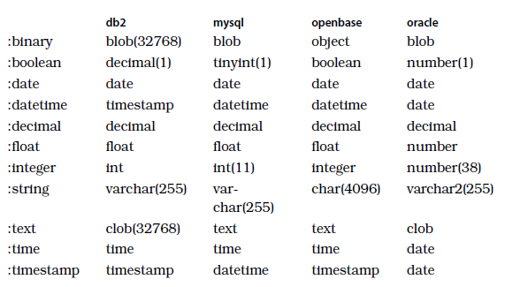
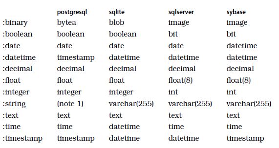

```ruby
NATIVE_DATABASE_TYPES = {
        primary_key: "serial primary key",
        bigserial: "bigserial",
        string:      { name: "character varying" },
        text:        { name: "text" },
        integer:     { name: "integer" },
        float:       { name: "float" },
        decimal:     { name: "decimal" },
        datetime:    { name: "timestamp" },
        time:        { name: "time" },
        date:        { name: "date" },
        daterange:   { name: "daterange" },
        numrange:    { name: "numrange" },
        tsrange:     { name: "tsrange" },
        tstzrange:   { name: "tstzrange" },
        int4range:   { name: "int4range" },
        int8range:   { name: "int8range" },
        binary:      { name: "bytea" },
        boolean:     { name: "boolean" },
        bigint:      { name: "bigint" },
        xml:         { name: "xml" },
        tsvector:    { name: "tsvector" },
        hstore:      { name: "hstore" },
        inet:        { name: "inet" },
        cidr:        { name: "cidr" },
        macaddr:     { name: "macaddr" },
        uuid:        { name: "uuid" },
        json:        { name: "json" },
        jsonb:       { name: "jsonb" },
        ltree:       { name: "ltree" },
        citext:      { name: "citext" },
        point:       { name: "point" },
        bit:         { name: "bit" },
        bit_varying: { name: "bit varying" },
        money:       { name: "money" },
      }
```